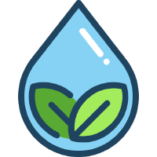
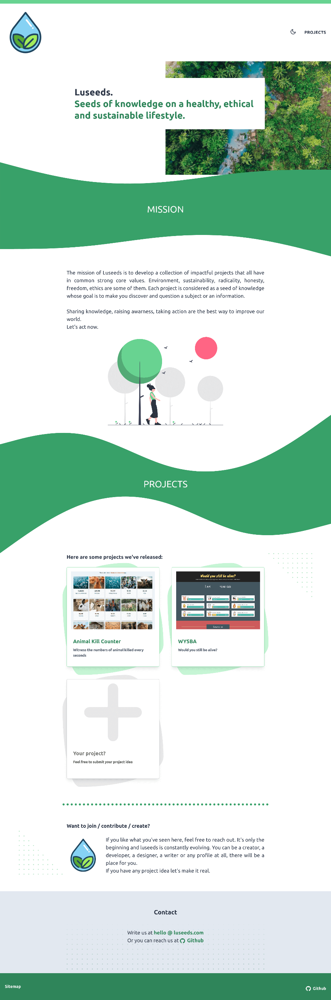

<p align="center"></p>

# luseeds.com

Seeds of knowledge on a healthy, ethical and sustainable lifestyle.



---

Based on [Gridsome](https://gridsome.org) and [Gridsome Portfolio Starter](https://github.com/drehimself/gridsome-portfolio-starter)

To run it locally:

```
git clone git@github.com:luseeds/luseeds.com.git
cd luseeds.com
npm i
npm run develop
```

To build a static/prod ready version

```
npm run build
```
